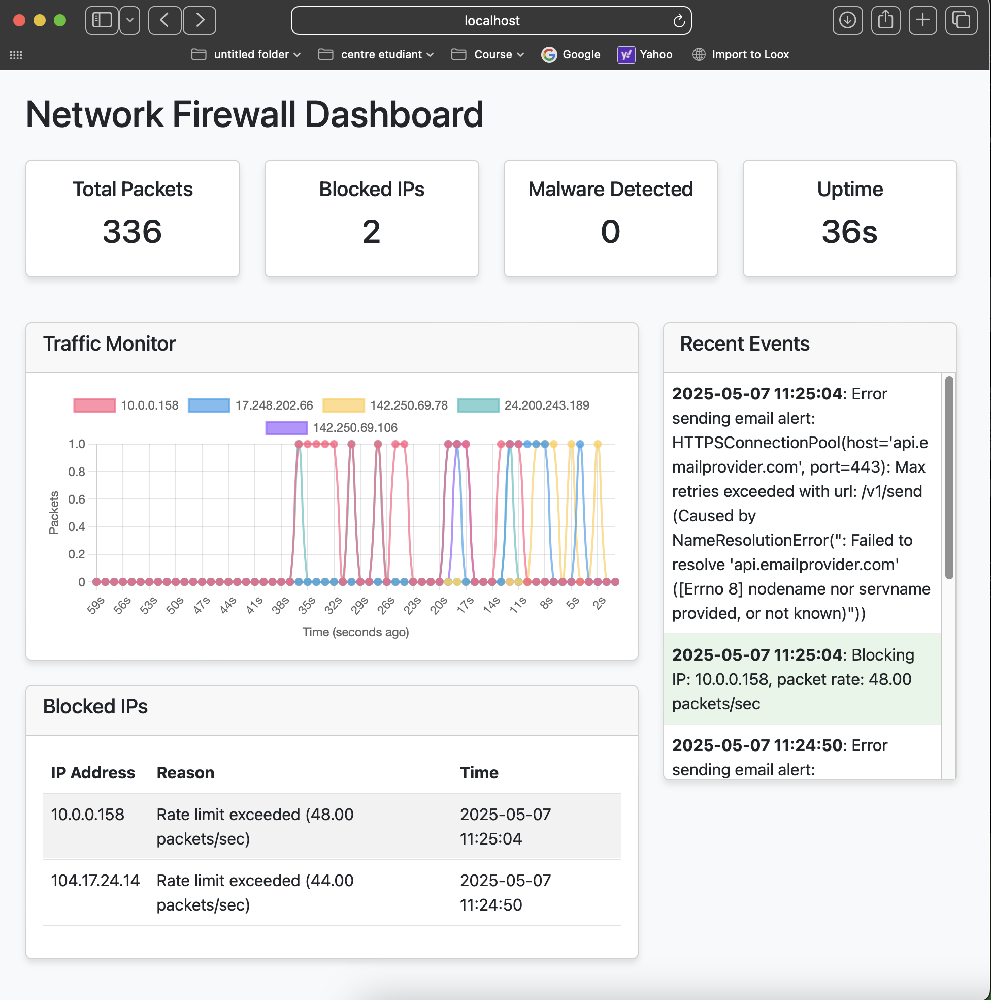

Network Firewall using Python

  
*This is a screenshot of what the firewall dashboard looks like, it shows, in real time, the number of total packets sent, the blocked ip adresses, any malware detected and the uptime.* 

Overview

This project focuses on monitoring network traffic, detecting and blocking IP addresses that exceed a defined packet rate, and identifying the presence of the Nimda worm signature in network traffic. It includes real-time packet rate analysis, automatic IP blocking, and a dashboard for visualizing traffic patterns and blocked addresses. The system is also designed to send email notifications to the administrator when an action, such as blocking an IP address, is taken. This tool is continually being improved, I will add new features and enhancements regularly. This is, for the time being, a proof-of-concept.

Key Features

Network Traffic Monitoring:
The system monitors incoming and outgoing network packets in real-time, using packet capture libraries or raw socket interfaces. It continuously tracks the number of packets sent by each IP address within a second, ensuring efficient analysis of network behavior.
Packet Rate Analysis:
The core functionality of the project is to analyze the packet rate per IP address. If an IP address exceeds a threshold of 40 packets per second, it is flagged for further action. This helps to identify potential network abuse or DoS (Denial of Service) attempts based on packet flooding.
Nimda Worm Detection:
The system also analyzes packet content to detect signatures associated with the Nimda worm. If a packet matches a known Nimda worm signature, it is flagged as malicious, indicating a potential security threat.
IP Blocking:
Once an IP address exceeds the threshold of 40 packets per second or is flagged for containing the Nimda worm signature, the system automatically blocks that IP address. This is done through firewall rule modifications, effectively preventing any further malicious activity from the identified IP.
Email Notifications:
To ensure prompt action and awareness, the system sends email notifications to the administrator whenever an IP address is blocked. The notification includes details about the blocked IP, the reason for blocking (excessive packet rate or worm signature detection), and relevant timestamp information.
Data Visualization Dashboard:
A dashboard provides real-time visualization of network traffic data. It shows key metrics such as the number of packets sent per second, IP addresses that have been blocked, and detected worm signatures. The dashboard offers an easy-to-read interface for administrators to monitor network activity and take necessary actions.
Ongoing Development

This project is actively being developed, with plans for future improvements. Upcoming features include more advanced malware signature detection, optimizations to handle larger traffic volumes, and enhanced reporting capabilities. The goal is to create a comprehensive traffic monitoring and security tool that can help prevent network-based attacks and ensure smooth network operation.

Conclusion

This project provides a real-time solution for detecting and blocking suspicious network traffic, specifically by analyzing packet rates and identifying worm signatures. It demonstrates key concepts in network traffic analysis, automated incident response, and real-time alerting. The tool is designed to be easily expandable, with plans for future enhancements to improve detection capabilities and performance.
